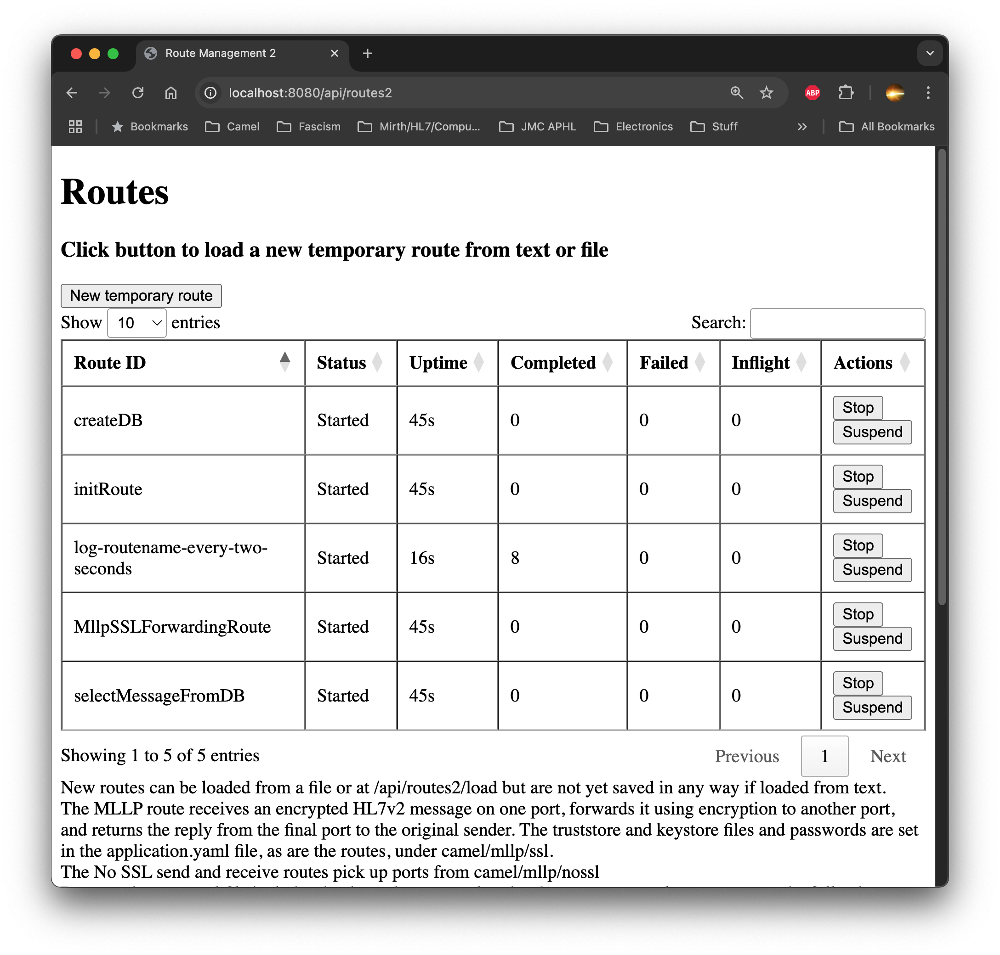

== Camel Example Spring Boot Mitch Connect
=== (using JPA/Hibernate)

This example shows how to receive and forward SSL encrypted
messages via MLLP. It logs the messages to a SQLite database
in its toplevel directory.  It also includes sample yaml 
routes for sending and receiving without SSL.

Login as user "admin" with password "password"
at http://localhost:8080.

In addition to sending messages to the various routes' ports,
you can communicate with the application at
http://localhost:8080/ui/routes and /ui/routes/load.

The same functionality is available via
http://localhost:8080/swagger-ui/index.html

To logout, go to http://localhost:8080/logout.

A video of some interaction is available here in mc_preview.mp4,
or at youtube as https://youtu.be/uD1KBy3wZ2Y.

Once you see the initial "MitchConnect" message,
you can point a web browser to localhost:8080/ui/routes
to see the loaded routes, and to localhost:8080/ui/routes/load
to load a valid yaml file route
or enter valid yaml text to create a route.  (Kaoto is a
wonderful tool for creating yaml routes.)

If the entered yaml is not valid it will not load but there
will be no message.  If it is valid you will see it when
your browser is redirected to /ui/routes.  Because the pom.xml
file includes the dependency camel-spring-boot-starter,
yaml routes should be able to use the following components without
needing adding dependencies:

* bean: Invokes methods on Java beans registered in the Camel registry.
* browse: Inspects messages received on endpoints that support browsing.
* controlbus: Manages and monitors Camel routes.   
* dataformat: Uses Camel data formats as regular Camel components.
* dataset: Provides data for load and soak testing.
* direct: Calls another endpoint within the same Camel context synchronously.   
* language: Executes scripts in various languages supported by Camel (e.g., simple, groovy, etc.).   
* log: Logs message data.
* mock: Mocks endpoints for testing routes.
* ref: Routes messages to endpoints looked up dynamically in the Camel registry.   
* rest: Exposes and consumes RESTful services.
* saga: Implements the Saga pattern for distributed transactions.
* scheduler: Generates messages at specified intervals using java.util.concurrent.ScheduledExecutorService.
* seda: Asynchronously calls another endpoint within the same JVM.   
* stub: Stubs out physical endpoints during development or testing.
* timer: Generates messages at specified intervals using java.util.Timer.
* validator: Validates message payloads using XML schema.
* xpath: Evaluates XPath expressions.
* xslt: Transforms XML payloads using XSLT templates.   

You can Stop and Suspend routes.  Stopped or suspended routes
can be Started or Removed.

The application.yaml file is in src/main/resources, and keystore
and truststore and port information is under camel: mllp: ssl:
for the SSL route and camel: mllp: no_ssl: for the unsecured send
and receive routes.

Routes under src/main/resources/loadedroutes are loaded on startup;
routes in src/main/resources/unloadedroutes include hello.yaml 
and hello2.yaml, which just write to the log every two 
and five seconds, and fetchCDA.yaml, which includes a route that
goes out and retrieves a sample CDA from HL7 at github and
uses xslt to extract <title> and <text> and <table>s from sections,
writing an HTML file to /tmp.

(These are suitable routes to load via 
http://localhost:8080/ui/routes/load or the button on 
http://localhost:8080/ui/routes.)

Note that the routes display shows exchanges processed during
the current run, while /ui/db/counts shows how many message
writes have taken place for each route.  There can be multiple
message writes for a route, to capture the body at different
stages.

The preloaded mllp forwarding route can be tested by going
to util and running python3 mllpreceive.py to start an SSL-secured
listener on port 15678 and then, in another shell,
running python3 mllpsend.py to send with SSL to port 15679.

All message initial bodies are written to a database table via
"RoutePolicy." 
As distributed in this jda branch, the database is a SQLite3
file located in the root folder as route-messages.db, which is
managed by Spring JPA and Hibernate.

Route bodies are written at the beginning and end of each exchange along with 
route id, exchange id, and timestamp, and are also written when a bean is 
called within the route: 
----
- to: "bean:routeMessageService?method=logCurrentBody(${exchange},'more id')"
----

Timestamps are milliseconds into the unix epoch, and SQLite will
produce human readable dates from:
----
select *, datetime(timestamp_processed/1000,'unixepoch','localtime') as local_datetime from route_messages;
----

For the sending route to send, place a valid HL7v2 message
in /tmp/hl7msg.txt.  Once sent, it will be moved
to /tmp/sentmessages.

Beware: this is more a learning experience product than anything
showing best practices.  Still, it provides one path to follow
should you run into trouble getting started on something similar.

If you are just exploring the Camel and Spring Boot combo,
please note that Kaoto is a fantastic open source yaml route
graphical designer, and you can use Jconsole to look at route
statistics.  

Wireshark is useful for confirming that traffic is encrypted.

DB Browser for SQLite is useful for examining the messages
written to database.

=== How to run

You can run this example by installing Java 21+ and maven (I'm using 3.9.9)
and using +

    `mvn clean spring-boot:run` +
    or +
    `mvn clean install` +
    `java -jar target/mc-1.0.0-SNAPSHOT.jar` +

Note: I've built on MacOS using openjdk 23.0.2. The first run will
result in a large number of downloads to your local maven repository.

=== Help and contributions

This is an in-progress hobby-level effort, and I am by no means
an expert on Camel or Spring Boot or SSL/TLS.  I just realize that
Mirth Connect is going proprietary, that it charges for SSL,
and have long thought that Apache Camel may offer an alternative.

If you hit any problem using Camel or have some feedback on Camel, then please
https://camel.apache.org/support.html[let the Camel Riders know].

If you have questions or comments about this example, which will
develop further along an unknown schedule,
let me know at mjtrac@gmail.com.  Please especially let me know
if you have problems building it; Java 21, maven, and mvn spring-boot:run
should suffice.

Thanks.

Mitch Trachtenberg

=== Images 

The files are in the images directory if they don't render for you
in this document.

==== Wireshark screen caps:

image::images/Unsecured1.png[]

image::images/Unsecured2.png[]

image::images/SSL.png[]

==== Debug output (with SSL debugging)

image::images/UnsecuredSendOutput.png[]

image::images/UnsecuredRcvOutput.png[]

image::images/SecuredRcvAndForwardOutput.png[]

==== Route Management Screen /api/routes2[]

